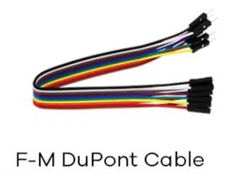

### Rust code

#### General board wiring
One or more of the four **blue** side rail sections (two per side) should be connected to any ground pins on the Pico (3, 8, 13, 23, 33, or 38).  This allows all devices to use the **blue** side rail as a ground.

The red side rails can be connected to one of the Pico power pins - 3.3v at Pico pin 36 or 5v at Pico pin 40 -
 being careful regarding what devices connect to which power source.

#### Wiring the LCD

The LCD comes with a four pin i2c adapter.  You will connect these pins to the
Raspberry Pi Pico using four F-M (Female to Male) Dupont wires.

  
<br>
<br>

The LCD's four pin layout is shown in the images below.  Starting at the top:
  - GND: Ground, connect to ground using blue ground side rail, or to a Pico ground pin*
  - VCC: 5v power, connect to Pico VBUS (Pico pin 40)
  - SDA: serial data, connect to GPIO 0 (Pico pin 1)
  - SCL: clock, connect to GPIO 1 (Pico pin 2)

  *Pico ground pins: 3, 8, 13, 23, 33, or 38

  
<br>
<br>
#### Wiring the DHT20

 Facing the dht20's "grated" side with "ASAIR" right above the pins:
 Starting at the far left:
  - pin 1: power, connect to PICO pin 36(3v) or 40(5v) directly, or by using red rail
  - pin 2: SDA (serial data), connect to GPIO 18 (Pico pin 24)
  - pin 3: Ground, connect to ground using blue ground side rail
  - pin 4: SCL (clock), connect to GPIO 19 (Pico pin 25)

  
<br>
<br>
#### Wiring the LEDs
The external leds have two wires: the long one is positive, the short one is ground.  The led ground gets wired to the ground "rail" (blue) that ties into a Pico ground pin.  The longer led lead is wired to one of the GPIO pins, using a 220 resistor as the wire.  The code in this repo has the following connections:

 - Red to GPIO 15  (Pico pin 20)
 - Yellow to GPIO 14  (Pico pin 19)
 - Green to GPIO 16  (Pico pin 21)
 - Yellow2 to GPIO 13 (Pico pin 17)
 - Red2 to GPIO 12 (Pico pin 16)

 - Ground to a grounded blue side rail, or to one of: 
   - Pico pins: 3, 8, 13, 18, 23, 28, 33, or 38

_The pins should be side by side in the order shown above (red, yellow, green, yellow2, red2)_

### To Run This Code

 - Make sure you have Rust installed in the directory ```rustc --version```
    - if error appears, initialize Rust with ```curl --proto '=https' --tlsv1.2 https://sh.rustup.rs -sSf | sh``` 
        and then for BASH run ```. “$HOME/.cargo/env"```

- Set the target for the RPP ```rustup target add thumbv6m-none-eabi```
- Install cargo crate package dependencies ```cargo install elf2uf2-rs```

To check this code to make sure it compiles:  navigate to the top level of the workdir after cloning the repo (OSU-RPMH) and run the following command:

```cargo build```   (or ```cargo check```)

To run it, you will plug your Pi Pico to the USB connection with your computer, __holding the "boot selector" button on the Pi Pico down while plugging it in (see image below)__.  You will then be able to see the Pico as a USB device on your machine ```RPI-RP2```.  In your IDE terminal, run:

```bash
cargo run
```

You may find your computer generates an error popup, complaining that you "unplugged" the usb device without ejecting.  This appears to be normal and unavoidable. Once the executable transfers, the Pico ejects itself, reboots and runs the program. Just click to close that warning.  

**One additional note:** 
Once you have loaded a program executable onto the Pico, you can re-run the program any time by plugging it into the computer USB or any USB power source without holding down the "boot selector" button.  The program will run automatically.


### Testing

This project has several testing scripts that can be used to verify the correct functioning of each of the project components both individually and collectively. To run the testing scripts, connect the Raspberry Pi Pico using the connection process described above, and execute `cargo run --bin \[script name without file extension\]`. For example, to run the test script for the led array, execute `cargo run --bin led_test`. The expected functionality for each test script is described in the script file (found in the `bin` directory).

Currently available test scripts:
- `led_test.rs`
- `sensor_test.rs`
